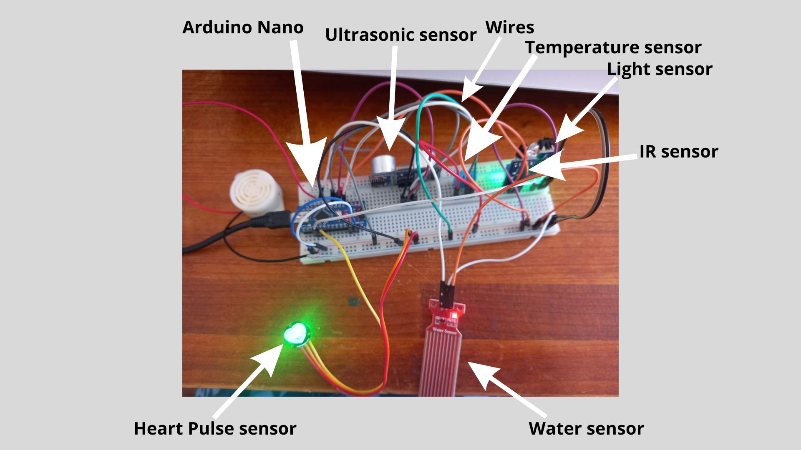

# arduino-blind-stick
This repository contains the code and diagram for an Arduino project that helps blind people navigate. The stick is equipped with ultrasonic sensors that can detect obstacles in front of the user. When an obstacle is detected, the stick will emit a sound to warn the user. The stick can also be used to measure the distance to obstacles.

To use the stick, simply hold it in front of you and move it around. The sensors will detect obstacles and emit a sound if an obstacle is close.

This project is designed to help blind people navigate safely and independently. It is a great way to give back to the blind community and make a difference in the lives of others.

Getting Started
To get started with this project, you will need the following:

An Arduino Uno or compatible board
Three ultrasonic sensor
A buzzer
A breadboard
Jumper wires
Water sensor
Light sensor

You can check the below image too

License
This project is licensed under the MIT License.
